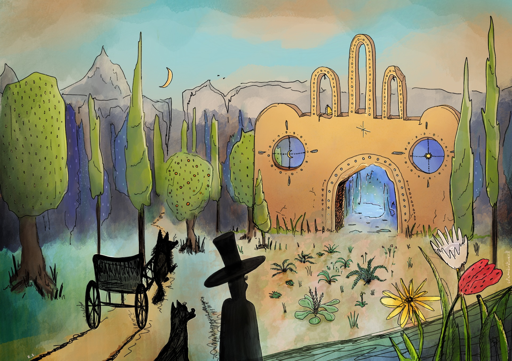

Gimė jis prieš tūkstantį metų, ypatingoje vietoje. Ties pat žmogaus pasaulio riba. Turbūt todėl ir gimė kitoks. Pusiau žmogus, pusiau kažkas visai kito.

Prieš patekant saulei, po sunkių darbų vežimu dardėdavo takeliu Grubeno kalvų šešėliais. Čia pažinojo kiekvieną akmenį. Daugelį medžių milžinų buvo pats pasodinęs. Vakarais  žvėrys ir paukščiai rinkdavosi klausytis pasakojimų iš tolimų jo kelionių. O jei kas visai svetimo ir baugaus atklįsdavo į jo pasaulį, mokėjo gražiai išprašyti.

Dar jis pildė norus - žvėrių, medžių ir net akmenų. Pildė ir žmonių. Tik ne visi mokėjo suprasti tokius stebuklus - gaunant, kažką vis tiek teks atgal atiduoti - tokie gamtos dėsniai. O žmonės buvo godūs, dažnai jiems galiausiai už norus tekdavo atiduoti daugiau nei norėdavo. Tik kaltę kai kurie ne sau suversdavo, o Pinčiukui.

Nakties šuva baugiai cyptelėjo patrauktas už vadelių ir vežimas sustojo. Pinčiukas pirmą kartą po tūkstančio metų drįso pažvelgti vidun, už arkos. Juodi pirštai pajuto vėsų ir tvirtą akmenį, o saulės spinduliai jau nutvieskė aukščiausius debesis, tįso pirmieji šešėliai. Naktis baigėsi. Mėlyna bedugnė jaukioje aikštelėje vis dar alsavo vėsa, tokia gili, bet tokia sava. Čia, prieš tūkstantį metų ir atėjo į šį pasaulį.

“Tik įmerksiu pavargusias kojas į vandenį” - mintyse nusišypsojo juodasis. Seni paparčiai sulingavo tamsiuose delnuose pakilus ryto vėjeliui, o begalinė gelmė tyliai atsiduso.

Ir galbūt jau nieks nesužinos, kokias paslaptis ji slėpė. Bet žmonės kalba, kad ten dingo paskutinysis iš mūsų pinčiukų. O paslapčių pasaulyje visada tebūna daugiau, nei atsakymų - taip sakydavo jis pats.
