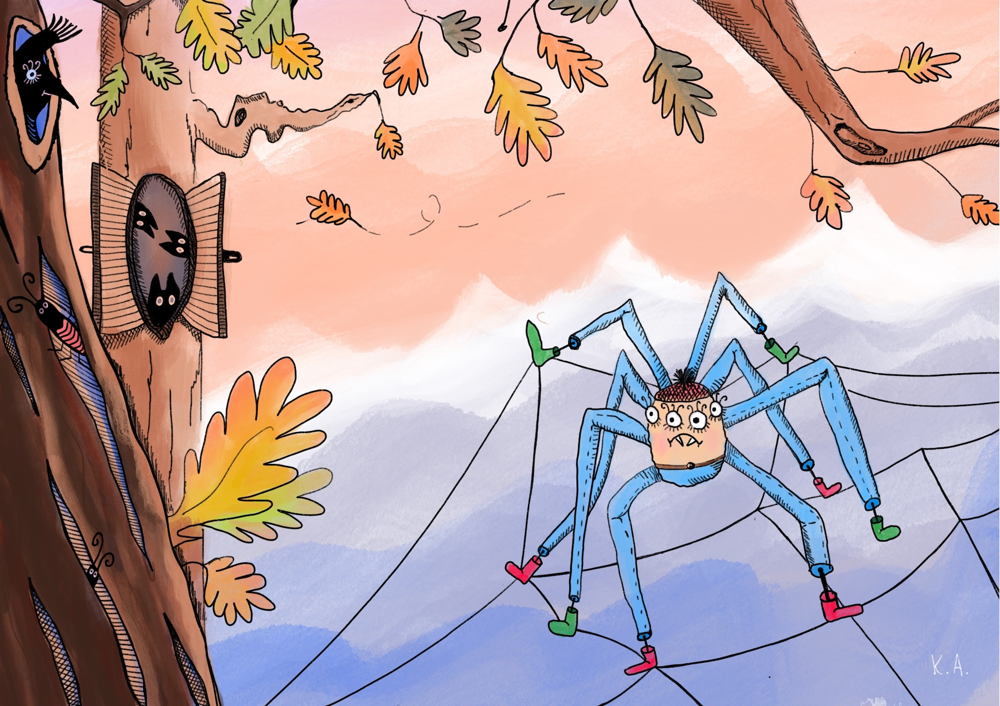
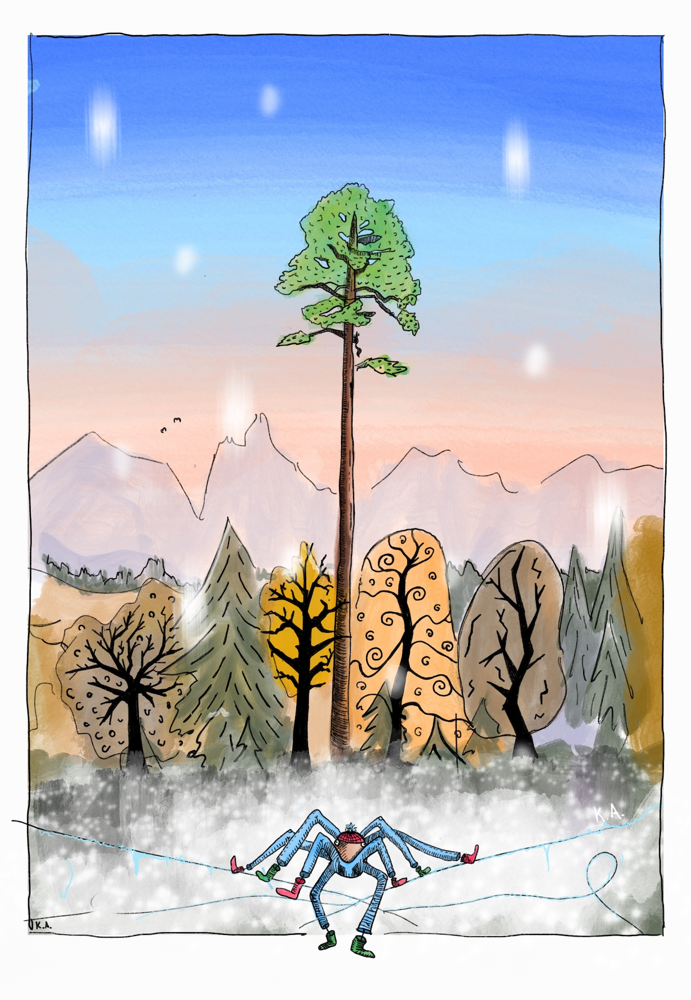

It seemed to the spider that winter came earlier every year. This time winter arrived on a Saturday, before the leaves had even fallen. All of the spider's friends hid away. Some curled up in warm hollows with their families, others in cozy burrows. Only the spider had nowhere to go.

By evening it began to snow and sadness squeezed tighter than ever. No place to shelter, no one to share a fly with. He decided to end it all - to jump from the top of the pine that grew at the edge of the field.

The pine was very tall - the spider climbed it for more than a day while a blizzard raged around. But the higher he climbed, the brighter the world looked and the farther he could see. At last the pine rose above the other trees... "How beautiful," he murmured. "I must be the happiest of all creatures, because I live amid such beauty..." Nearby, by the river, stood a homestead, and firelight glowed in its windows.

The spider lowered himself down the pine on a thread and, puffing through the snow, hurried to the riverside cottage. Luckily he had bought warm boots back in spring. In a corner between the stove and an old barrel he met a little spider.

The little spider was a truly monstrous - the spider fell in love with her at once. He was no longer alone, and it grew even more cheerful. So ... the spider went on living happily, and very soon, summer came.

