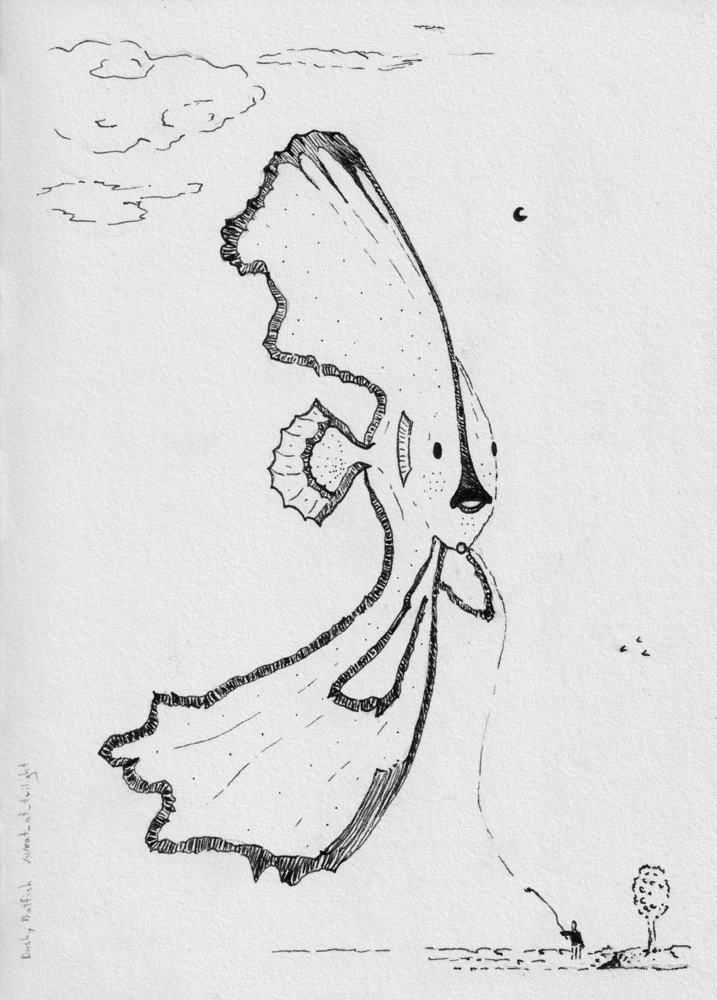
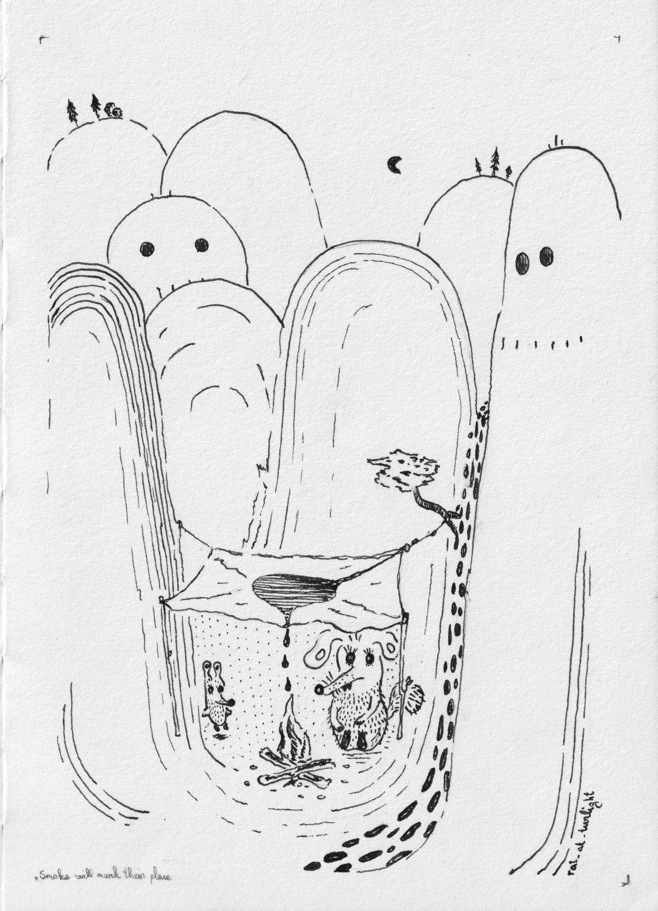
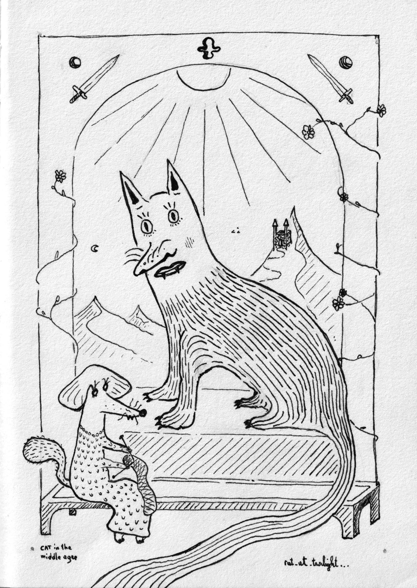
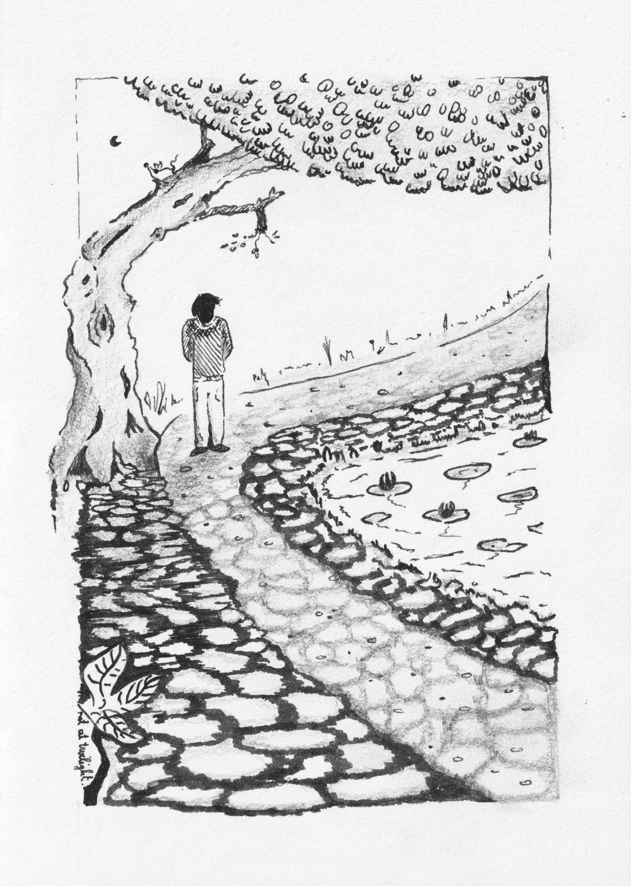
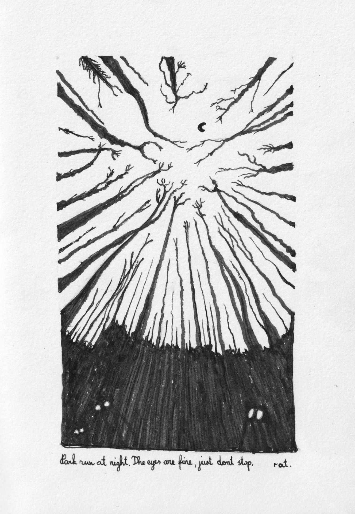

This week I was learning to draw using pen and ink. Quite different experience from using an iPad - I enjoyed it greatly. I plan to do this for quite awhile. 

All the sketches were made for the [https://reddit.com/r/SketchDaily](SketchDaily) subreddit. 

"A dusky batfish" - what a weird, beautiful fish. Not fully reflected in the sketch though :) 

"Mark your place" - I really like how the trolls look, but ruined the rat lair. Too many various dots, inconsistent lines etc.

"Cat as if drawn in the middle ages" - well, turns out cats in the middle ages were drawn as these horrifying creatures. Do google them. 

"Dappled shadows" - this was my favorite work from this week. The intention was for the circular things to be the shadow for the tree, but I overdid it, and now they look like... walking stones? as they're everywhere. Still like it. 

Free friday - drew a copy of a photo I took during todays long run in the park at night. It's always a bit scary there, but as long as I keep going...
