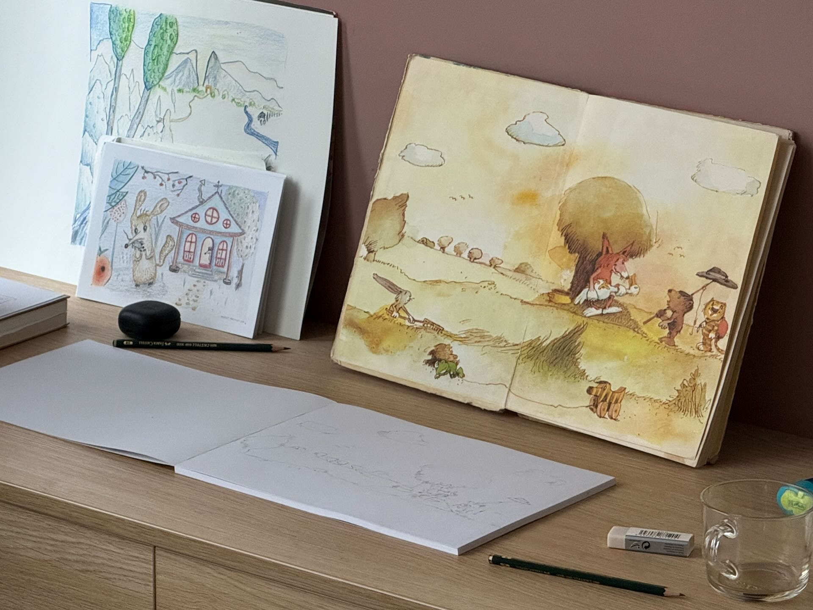
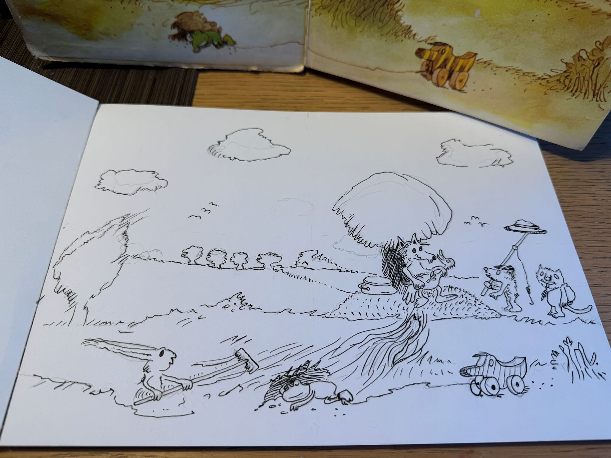
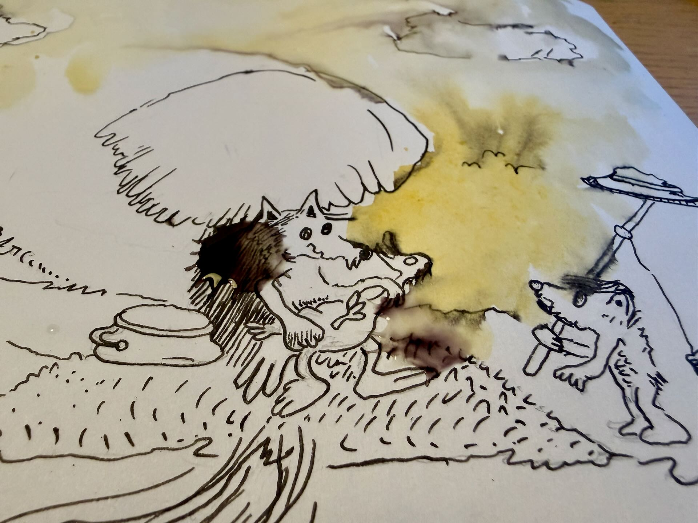
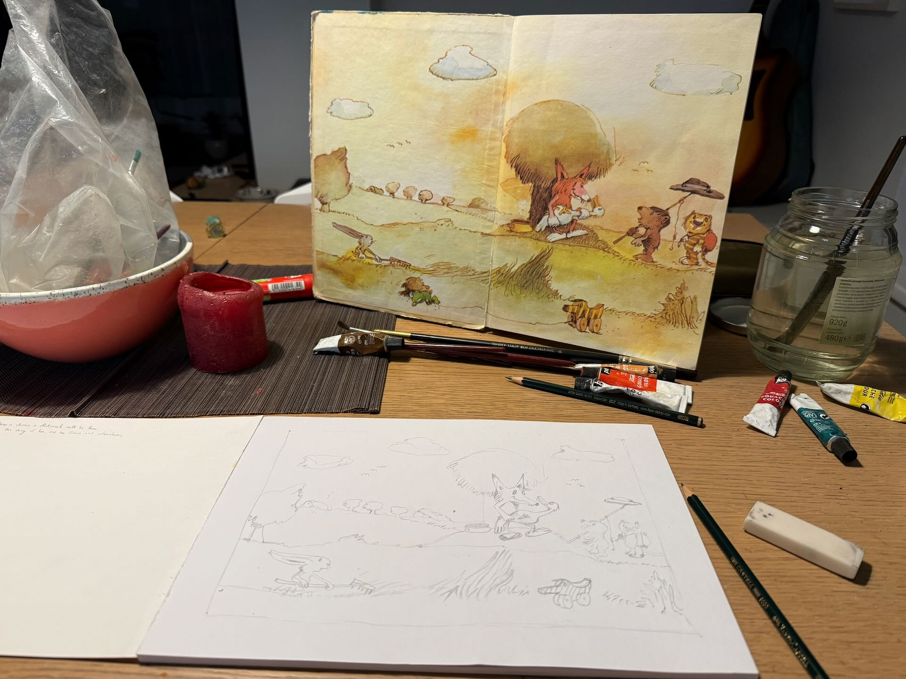
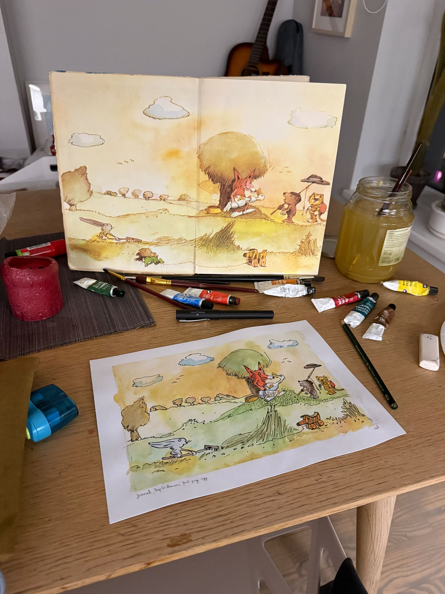

Vakar toliau mokiausi senų vaikų knygų, "Naivaus" iliustracijos stiliaus – šį kartą pagal Janosch knygą „Kelionė į Panamą“. Man tai lengviausia tiesiog kopijuojant, ypač kai naudoji naują techniką (akvarelė ir rašalas).

Viršuje – galutinis rašalo ir akvarelės eskizas. Būčiau trukęs mažiau nei kelias valandas, jei viskas būtų pavykę, bet deja.

Pradėjau ryte, tikėdamasis užbaigti eskizą dar iki antros kavos laiko iki pietų.

Su pieštuku viskas kaip ir pavyko gerai, tada viską apibrėžiau rašalu.

Dejan nepatikrinau, ar mano rašalas atsparus vandeniui (...), kas pakankamai neįtikėtina. Štai kas gavosi, kai bandžiau ant rašalo linijų dėti akvarelę.

Supykęs jau vakare viską perpiešiau pieštuku. 

Akvarelę tepiau tiesiai ant pieštuko. Po to, kai išdžiuvo, jau ant akvarelės užpiešiau rašalu – kaip ir pavyko, bet popierius įgavo tą įtrintą tekstūrą, kuri būna pigiam popieriui po vandens aplikacijos. Nuo to rašalas išsiliejo popieriuje ir linijos tapo labai storos – nebegalėjau nieko tiksliai piešti. 

Trumpi užrašai apie mano pradinukines klaidas:

- Reikia nusipirkti gerą akvarelės popierių (medvilninį) – šis netinka.
- Rašalą tepti prieš akvarelę, bet naudoti tinkamą (vandeniui atsparų).
- Naudoti tikrą akvarelę, jei noriu akvarelės efekto – dabar naudojau atskiestą guašą, bet jis turėjo per daug pigmento (?), ir skiedžiant atsirado keisti taškai.
- Vengti spalvos „įtrinimo“ plunksna ant popieriaus – nuo to tik susidaro neaiškios dėmės.

To užteks pradžiai. Iki kito karto.
