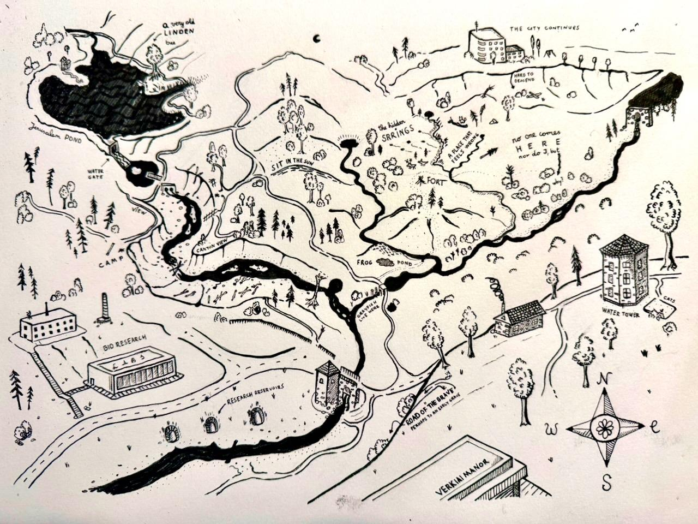
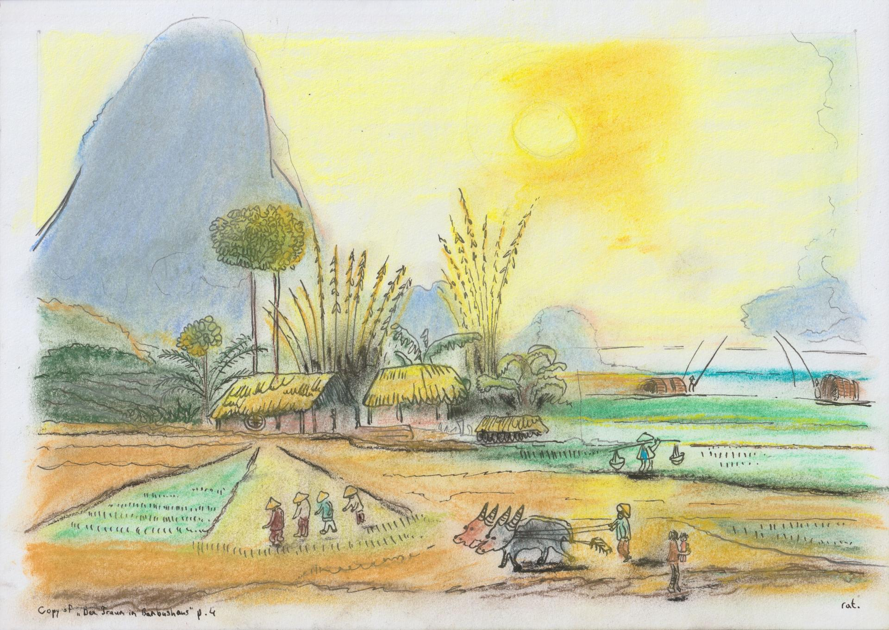
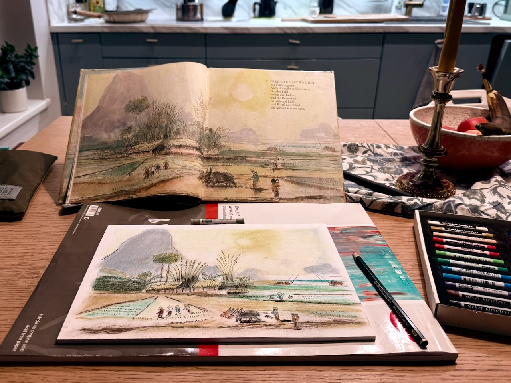

This week I worked on a sketch for a map of my local favorite area - the foresty hills full of springs and streams behind the Verkiai Manor in Vilnius, Lithuania. The sketch is very flawed, and not yet finished (I'll post it on "maps" section when it is). I'm unhappy as I put too much stuff in there, with no real focus points. Must leave more empty space the next time, and, for example, draw the trees in clusters. However, I'm proud to have started on this, as I plan to refine it and draw my favorite areas of the city this way. 



I also bought a new book from the old used book store near the central Halės market. 

```
Der Traum im Bambushaus
By Helmut Preissler and Gerhard Gossmann
1987

ISBN 3-358-00650-6
```

It's a German book, and it seems that children's german books from that era have a sketchy, naive illustration style that I really like. Very likely cause I was born during these times :). 



Immediately I tried to copy a few illustrations. Presumably, the artists used real nibs + ink and watercolor, I've used a fountain pen + soft pastels and -100lvl in skill. Still great fun, and I hope to improve on such style + real media, and draw my own eventually.

For the next time, I already received my real, fine dip-in nibs + ink. Perhaps using those I'll be able to archieve the "fade out" effect on some strokes as ink runs out in the nib.

