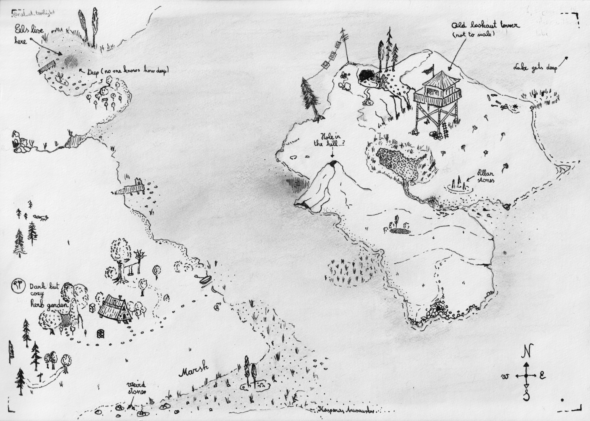

I'm trying to learn this "pen and ink illustrated" style of maps to help with the evening stories for my kids. This one is for my "Ratsnack" series about a cannibalistic rat. The kids like it very much to go over these maps and choose a location to hear a story about.

This is my first try at actual ink for such a thing (but I did use iPad for this before). The island has an actual lake inside of it, based on this tiny island: https://maps.app.goo.gl/xye9EUnHANCzdbTX6

For the next one I'll try to improve (except for the drawing of objects themselves, which I hope will improve with time too):

- use more consistent patterns for shading, perhaps marking types of shading before hand for different locations
- define the light source for the objects in map and use to shade a bit
- keep scale more consistent
- be more patient and sketch it fully in pencil before using ink
- the compass needs more effort :)
- think more in small areas with empty space in between - better to develop fewer areas to a good standard, then to have lots of random trees that add nothing to the story I think. 
