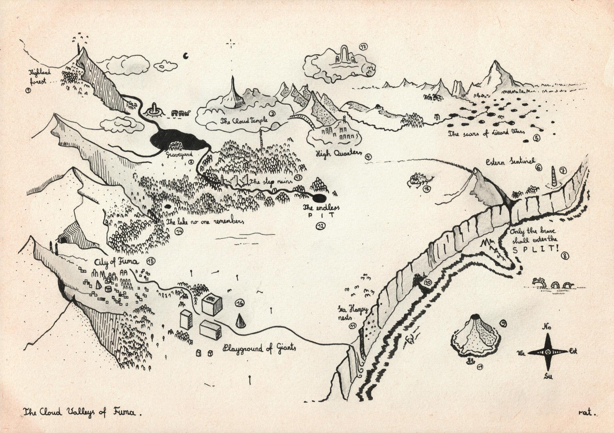

Fuma slėniai - seni ir nuostabūs taip, kaip būna su kažkada klestėjusiomis karalysčių vietomis, dabar lėtai grimztančiomis į nebūtį. Čia stovi Debesų Šventykla (3), kurioje baltieji burtininkai palaiko Žemai Sklandančią Žvaigždę. Šios ypatingą, tyrai baltą šviesą senieji magai naudoja savo burtams kalibruoti, kad nenuklysti į raudonąją pusę. 

Bėgant metams, senstant karalystėms, tokių vietų svarbą ėmė blėsti. Kam paprastam žmogui tie burtai? Ką tie burtininkai apskritai daro savo aukštuose bokštuose?

Karai nusiaubę Žemyną taip pat paliko gilių randų slėnyje. Didžiausias iš jų - Įskilimas (8) šalia Rytų Sargo kalno (6). Sakoma, kad palei gilaus tarpeklio kraštus keliautojai pastebėjo siaubingų padarų, o gal tai tik senų keliauninkų prasimanymai. 

Dar baisesnė nelaimė slėniui - vis plintančios smegduobės Rytų regione, atsivėrusios po Roplių Karų (5).

Burtininkams šventykloje vis dar pavyksta išlaikyti sudėtingus įrengimus veikiant. Fumos miesto, esančio slėnio pietvakariuose, gyventojai aptarnauja šventyklą. Tačiau prekybos keliai tuštėja, o žmonėms alkstant, kyla pagundų. Kartu slėnį aptraukia rūkas, pro kurį tyrai žvaigždės šviesai vis sunkiau prasiskverbti.

Sakoma, kad Kapinėse (2) Fumos gyventojai nebesilanko. Niekas nebežino, kas darosi su burtininkais, kurie, mirę nuo senatvės, tradiciškai nuo stebuklingojo stacionaraus debesies metami į ežero gelmes. Anksčiau šiuos valtelėmis surinkdavo bei laidodavo kapinių prižiūrėtojai. 

Ar Žemynas turėtų nerimauti dėl blėstančios Žemai Sklandančios Žvaigždės? 

Slėniai pilni paslapčių Tau, keliautojau, ištyrinėti. Koks bus tavo likimas...ar jį parašysi pats, o gal jį nuspręs žvaigždės? 