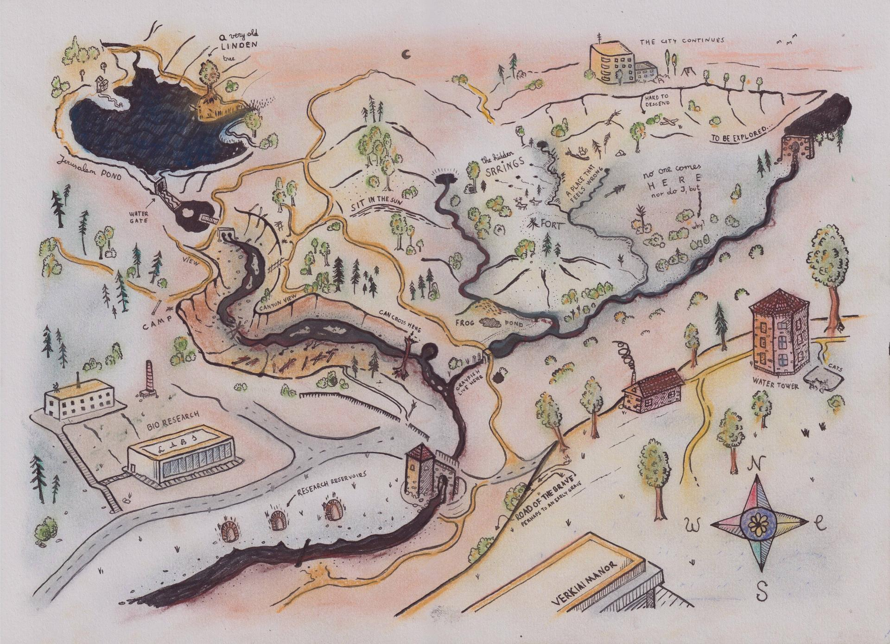
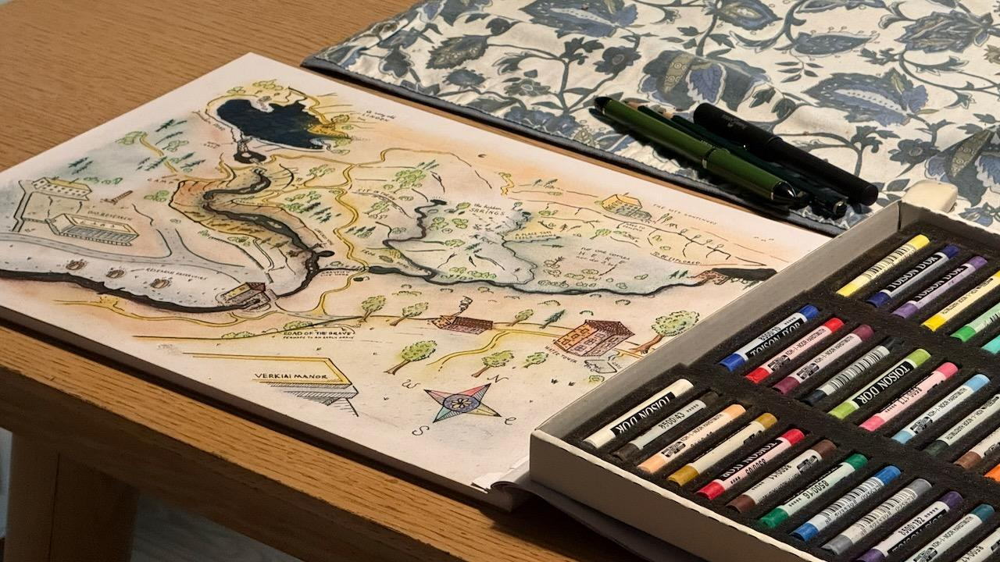
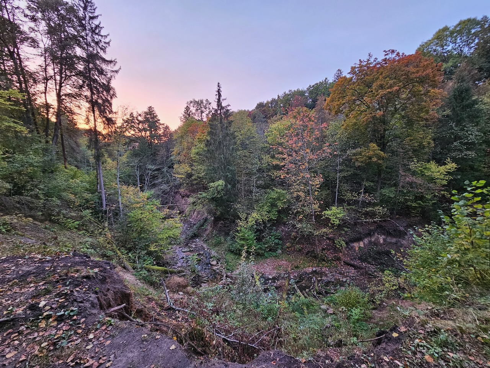
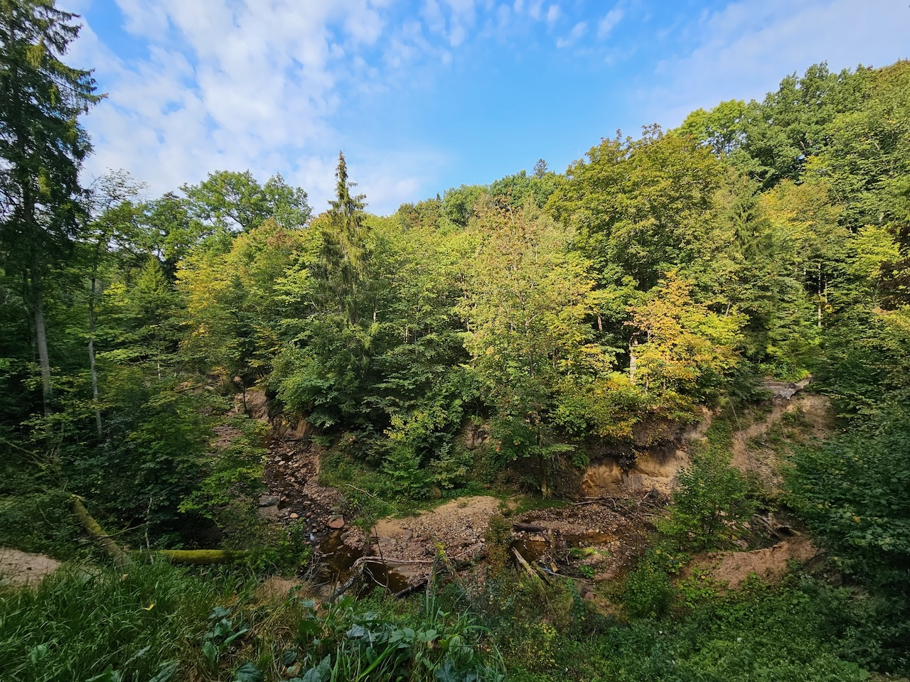

Dažnai stebiuosi, kaip mažai žmonių sutinku šalia bevardžių upelių už Verkių dvaro sodybos. Man čia labai gražu. Paėjus kiek giliau, upelių ir šaltinių tik daugėja - tikrai rekomenduoju pasivaikščioti. 

Žemėlapis pieštas iš atminties, ir nelabai tikslus. Priimkite jį kaip pasakų žemėlapį - kelią rasite, pasiklysti pavojaus ten nėra, o jei pavyks - tik dar geriau :) . 

Piešimo procesas

Here are a few pics from the real location. 

Vieta google maps:
<iframe style="width: 800px" src="https://www.google.com/maps/embed?pb=!1m17!1m12!1m3!1d2884.4966490217294!2d25.28415407735032!3d54.74832297272894!2m3!1f0!2f0!3f0!3m2!1i1024!2i768!4f13.1!3m2!1m1!2zNTTCsDQ0JzU0LjAiTiAyNcKwMTcnMTIuMiJF!5e1!3m2!1sen!2slt!4v1771930523699!5m2!1sen!2slt" width="800" height="420" style="border:0;" allowfullscreen="" loading="lazy" referrerpolicy="no-referrer-when-downgrade"></iframe>